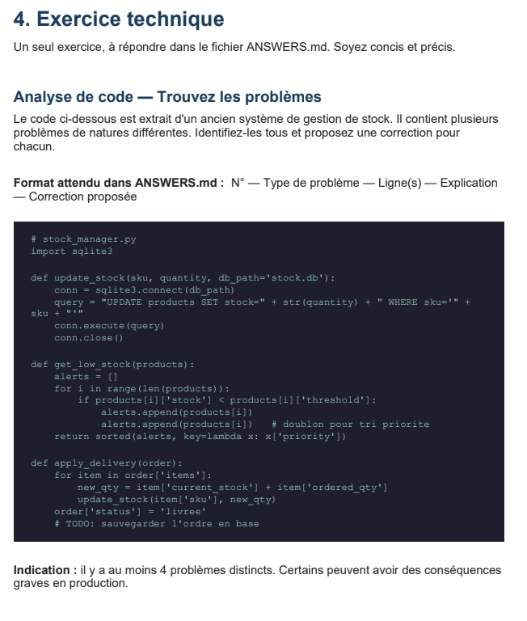

# ANSWERS.md



## 1 — Injection SQL (ligne 7)

La requête SQL est construite avec de la concaténation de chaînes.  
Cela peut permettre une injection SQL via `sku` ou `quantity`.

Pour éviter ce problème, il vaut mieux utiliser des requêtes paramétrées.

### Correction proposée

```python
query = "UPDATE products SET stock=? WHERE sku=?"
conn.execute(query, (quantity, sku))
```

---

## 2 — Absence de commit (ligne 10)

Les modifications faites dans la base de données ne sont jamais sauvegardées explicitement.  
Du coup, les changements risquent de ne pas être enregistrés.

### Correction proposée

```python
conn.execute(query, (quantity, sku))
conn.commit()
```

---

## 3 — Mauvaise gestion de la connexion (lignes 5 à 10)

Si une erreur survient avant `conn.close()`, la connexion peut rester ouverte.  
Il serait plus propre d’utiliser un context manager avec `with`.

### Correction proposée

```python
with sqlite3.connect(db_path) as conn:
    conn.execute(query, (quantity, sku))
    conn.commit()
```

---

## 4 — Duplication des alertes (ligne 18)

Le même produit est ajouté plusieurs fois dans la liste `alerts`.  
Cela peut créer des doublons et fausser les résultats.

### Correction proposée

```python
alerts.append(products[i])
```

---

## 5 — Boucle peu lisible (ligne 15)

L’utilisation de `range(len(products))` n’est pas vraiment nécessaire ici.  
Une boucle directe est plus simple à lire et plus propre.

### Correction proposée

```python
for product in products:
```

---

## 6 — Risque de KeyError (lignes 16 et 24)

Le code suppose que certaines clés existent toujours dans les dictionnaires (`stock`, `threshold`, `priority`, etc.).  
Si une clé manque, le programme peut planter.

### Correction proposée

```python
product.get('stock', 0)
```

---

## 7 — Mise à jour non atomique du stock (ligne 25)

Chaque produit est mis à jour séparément.  
Donc si une erreur se produit pendant le traitement, certaines modifications seront appliquées et d’autres non.

Il vaut mieux utiliser une transaction.

### Correction proposée

```python
with sqlite3.connect(db_path) as conn:
    try:
        ...
        conn.commit()
    except:
        conn.rollback()
```

---

## 8 — Absence de validation métier (ligne 24)

Le stock peut devenir négatif ou incohérent si `ordered_qty` contient une mauvaise valeur.

Il faut vérifier les quantités avant la mise à jour.

### Correction proposée

```python
if item['ordered_qty'] <= 0:
    raise ValueError("Quantité invalide")
```

---

## 9 — Modification non sauvegardée (ligne 27)

La ligne :

```python
order['status'] = 'livree'
```

modifie uniquement l’objet Python en mémoire.  
Le changement n’est pas enregistré dans la base de données.

### Correction proposée

```python
UPDATE orders SET status='livree' WHERE id=?
```

---

## 10 — Absence de gestion d’erreurs

Aucune exception n’est gérée dans le fichier.  
En cas de problème, le programme peut s’arrêter brutalement sans afficher d’erreur claire.

### Correction proposée

```python
try:
    ...
except Exception as e:
    print(e)
```
